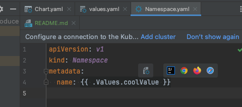
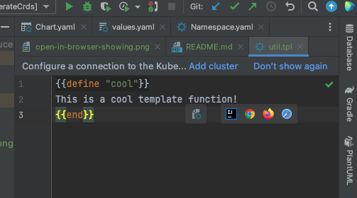

# IntelliJ Helm UI Bug

## Details

IntelliJ Version: 2025.2.5 (Build #IU-252.28238.7)  
Plugins: Helm (bundled)  

## Summary

(Post IntelliJ Update)

Helm template files trigger "Open in Browser" floating toolbar despite correct "File Type" associations
     
### Details

After updating to IntelliJ IDEA 2025.2.5 (Build #IU-252.28238.7), opening Helm template files (`.yaml`, `.tpl` inside a Helm chart structure) triggers the "Open in Browser" / "Web Browsers" floating toolbar in the top-right corner of the editor, when the editor window is hovered.

This behavior is typically reserved for HTML or Web-related files. Since these are backend infrastructure files, the browser preview options are irrelevant and obstruct the view.

### Screenshots

On Template

On tpl

## Reproduction Steps

1. Update to IntelliJ IDEA 2025.2.5 (Build #IU-252.28238.7).
2. Ensure the bundled Helm plugin is enabled.
3. Open a project containing a standard Helm Chart (like this one).
4. Open any file within the `templates/` directory (e.g., `Namespace.yaml` or `util.tpl`).
5. Observe the top-right corner of the editor area (as pictured above).

## Expected Behavior

The editor should display the file with YAML/Helm syntax highlighting without the display in browser floating toolbar.

## Actual Behavior

YAML/Helm syntax highlighting works correctly, but the display in browser toolbar appears

## Environment

* **IDE:** IntelliJ IDEA 2025.2.5 (Ultimate Edition)
* **Build:** #IU-252.28238.7

## Troubleshooting Performed (Issue persists)

I have already verified that:

1. `Settings | Editor | File Types | HTML` does not list `*.yaml` or `*.tpl` extensions.
2. `Settings | Editor | File Types | YAML` correctly lists the `*.yaml` extension.
